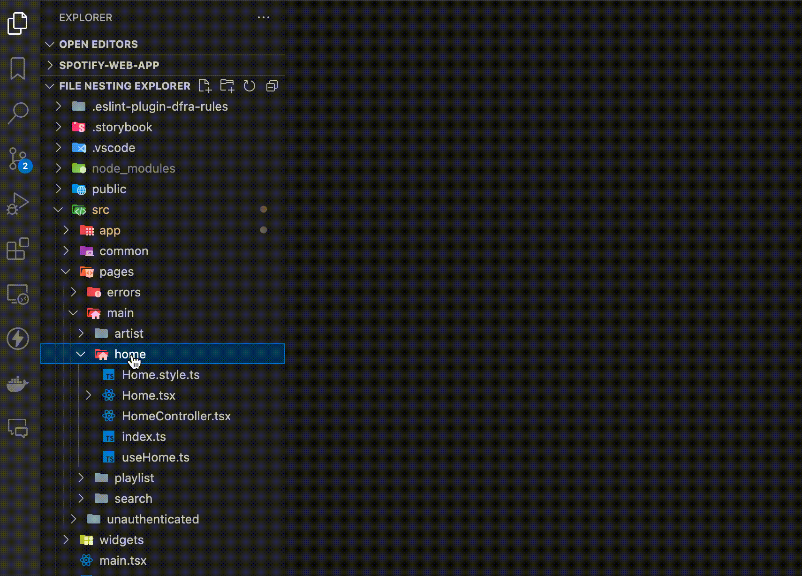
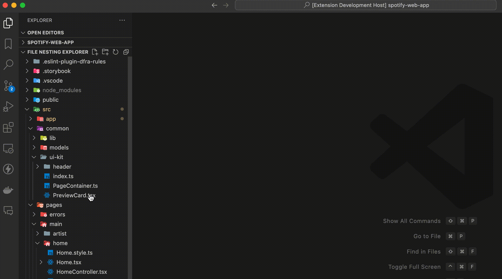
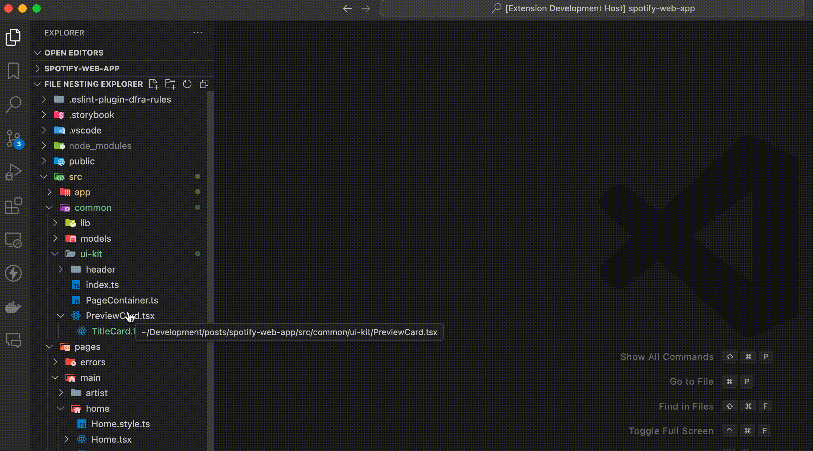
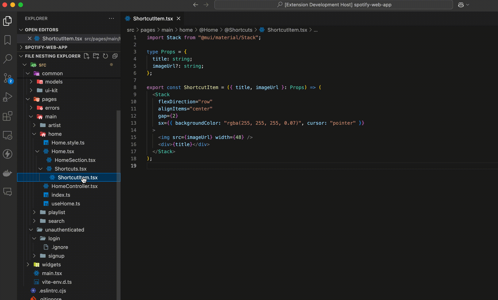

# React File Nesting Explorer

> Note: This extension is not the same as the [VSCode's File Nesting](https://code.visualstudio.com/updates/v1_67#_explorer-file-nesting) and is not integrated with it.

Build large React applications with ease by organizing your files in a minimalistic way. This extension allows you to nest your files in a tree structure, making it easier and more intuitive to compose your components and navigate your project.

## Learn more about React File Nesting Design Pattern

Post on Medium coming soon. Meanwhile, you can check out the post that inspired the concept behind this extension [Fractal — A react app structure for infinite scale](https://medium.com/hackernoon/fractal-a-react-app-structure-for-infinite-scale-4dab943092af).

## Features

- **New Nested File**: Create a new file and nest it under the currently selected file.

- **New Nested Folder**: Create a new folder and nest it under the currently selected file.

- **Delete File Nesting Container**: Delete nested files and folders under the currently selected file.

## Get Started

1. Install the extension.
2. Open the FILE-NESTING-EXPLORER view.
3. Right-click on a react file to create a new nested file or folder.

## How does it work?

Coming soon.

## Known Issues

Below are the known issues with the extension that are in the process of being fixed. Meantime, if you need any of these functionalities you can still open the default `vscode explorer panel` do what you need to do and go back to the `File nesting explorer`. If you find a bug, please report it [here](https://github.com/brucegroverlee/file-nesting-explorer/issues).

- **Paste file/folder from other vscode project**: When copying a file or folder from another vscode project and pasting it into the current project, the user gets an error message. [Issue #1](https://github.com/brucegroverlee/file-nesting-explorer/issues/1#issue-2716404277)

- **Copy and Paste a nesting file doesn't copy the folder container**: When copying a file and pasting it into another file, the folder container is not copied. [Issue #2](https://github.com/brucegroverlee/file-nesting-explorer/issues/2)

- **None of the `File nesting explorer` items can be editable**: Due to the VSCode API limitations, the items in the `File nesting explorer` are not editable. Instead, any time you need to rename a file or folder, or you have to create a new file or folder, you'll see the `InputBox` dialog at the top/center of the screen.

## License

This project is licensed under the MIT License - see the [LICENSE](LICENSE) file for details.
