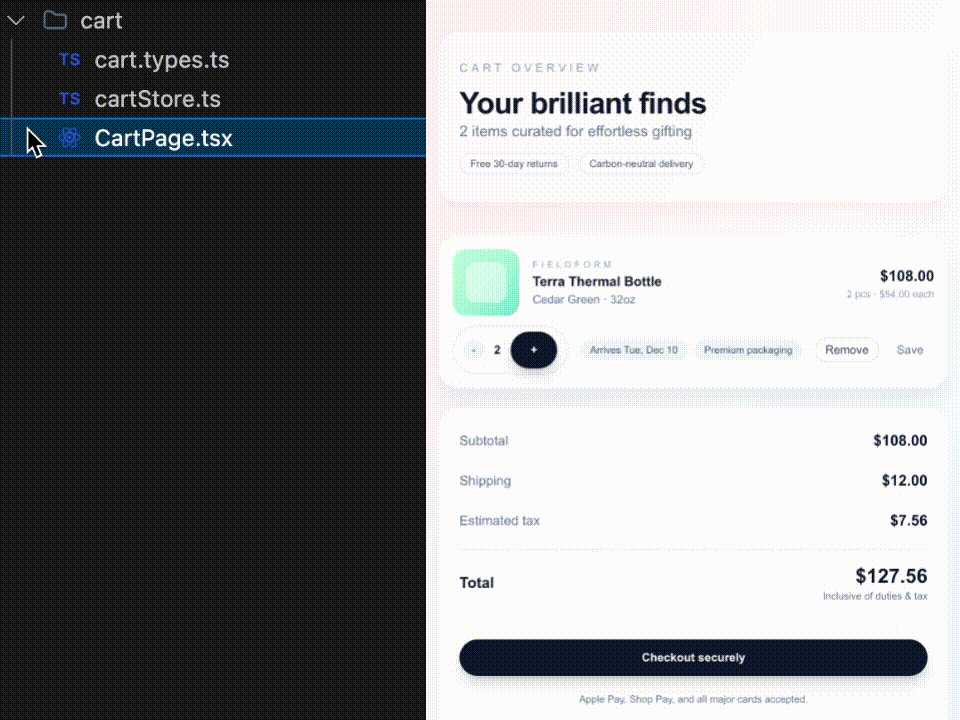
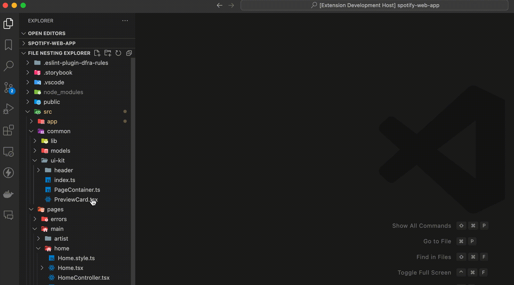
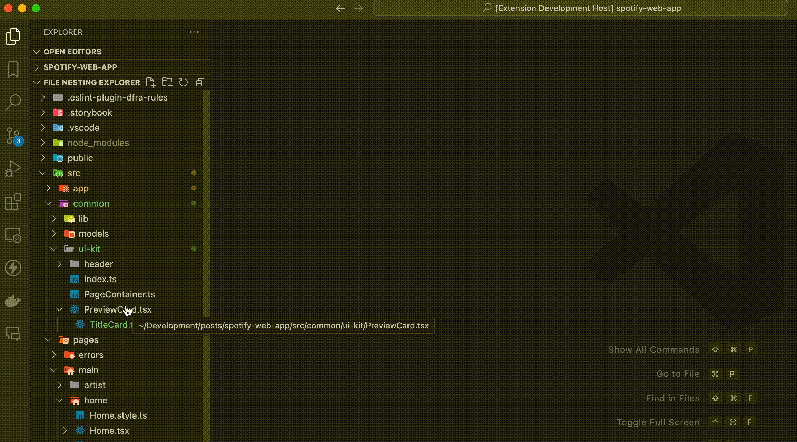

# React File Nesting Explorer

> Note: This extension is not the same as the [VSCode's File Nesting](https://code.visualstudio.com/updates/v1_67#_explorer-file-nesting) and is not integrated with it.

### Understand Your UI as a Tree

Organize React components in a way that mirrors your UI structure. By nesting files into a visual tree, `React File Nesting Explorer` helps you quickly understand component relationships and navigate large codebases with less effort.

## Documentation

- [Homepage](https://explorer.groverlee.me?utm_source=github&utm_medium=readme&utm_campaign=file-nesting-explorer)
- [Get Started: Learn how to use the extension](https://explorer.groverlee.me/get-started?utm_source=github&utm_medium=readme&utm_campaign=file-nesting-explorer)
- [Features: Explore the complete list of features](https://explorer.groverlee.me/features?utm_source=github&utm_medium=readme&utm_campaign=file-nesting-explorer)

## Learn more about React File Nesting Design Pattern

Read [React file nesting design pattern](https://medium.com/@brucegroverlee/react-file-nesting-design-pattern-74fe6edba127) on Medium.

## Main Features

- **New Nested File**: Create a new file and nest it under the currently selected file.

- **New Nested Folder**: Create a new folder and nest it under the currently selected file.

- **Delete File Nesting Container**: Delete nested files and folders under the currently selected file.

### Discover the rest of the features in the [Features page](https://explorer.groverlee.me/features?utm_source=github&utm_medium=readme&utm_campaign=file-nesting-explorer).

## License

This project is licensed under the MIT License - see the [LICENSE](LICENSE) file for details.
